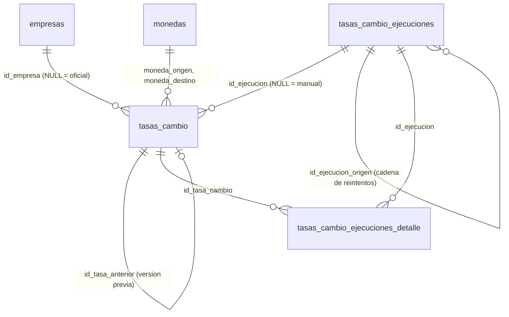

# Tasas de cambio: job automático

> **Estado (2026-10-05):** script `020_tasas_cambio_v2.sql` **aplicado en `eBD_SPD`** (tablas vacías); el job
> viene **deshabilitado** (`TasasCambio:Habilitado = false`) hasta completar la puesta en marcha (sección 12).
>
> Las reglas finas (umbrales de validación, esperas entre reintentos, significado exacto de cada estado) viven en el
> código, `Services/TasasCambio/`. Si este documento y el código no coinciden, manda el código y hay que corregir
> este documento.

## 1. Propósito

Obtener cada día hábil, sin intervención manual, la tasa de cambio oficial del **dólar (USD)** y del **euro (EUR)**
contra el **lempira (HNL)** y guardarla en `dbo.tasas_cambio` de `eBD_SPD`, con histórico versionado y una bitácora de
cada ejecución.

Reemplaza a la aplicación WinForms **APICambioAHNL**, que descargaba el Excel "Precio Promedio Diario del Dólar" del
Banco Central de Honduras (BCH) y guardaba la compra y la venta del dólar en **otra** base de datos. Decisiones tomadas:

- El destino es eGestion360-Web. Nada más lee la tabla vieja de la WinForms: **no hay puente** entre las dos bases.
- Se guardan **compra y venta**.
- La tasa **oficial** va con `id_empresa = NULL` (común a todas las empresas). Cada empresa puede registrar **tasas
  manuales propias**, que para ella prevalecen sobre la oficial.
- Si el BCH no publica el euro, el euro se **deriva**: EUR/USD del Banco Central Europeo (BCE) × USD/HNL del BCH, y
  se marca `es_derivada = 1`.
- El job lo despierta un **disparador externo** (GitHub Actions), porque el hosting descarga la aplicación cuando no
  tiene visitas.
- Los destinatarios de las alertas son **configurables**.

## 2. Convención de la tasa

Una sola convención en toda la tabla:

> **1 `moneda_origen` = `tasa` `moneda_destino`**. Ejemplo: `USD → HNL, tasa 26.8925` significa 1 USD = 26.8925 HNL.

- Las tasas oficiales siempre tienen `moneda_destino = 'HNL'` (moneda local, `TasasCambioCatalogo.MonedaLocal`).
- No se guarda la inversa (HNL → USD). Para pasar lempiras a dólares se **divide** entre la tasa.
- La estructura vieja (KPI_02) usaba el ejemplo contrario (`HNL → USD, 0.0403`); la v2 lo abandona.
- `tipo_tasa`: `COMPRA` (precio al que el sistema financiero compra la divisa), `VENTA` (precio al que la vende) o
  `REFERENCIA` (tasa única, sin compra ni venta; el job hoy guarda solo COMPRA y VENTA).
- `tasa` es `DECIMAL(18,8)`. El euro derivado se redondea a 4 decimales.
- Qué tipo (compra o venta) usa cada módulo al convertir (facturación, KPI) es una decisión de cada módulo
  (ver sección 14).

## 3. Fuentes

| `fuente` | Qué da | Papel | Estado |
|---|---|---|---|
| `BCH_API` | USD/HNL compra y venta (y EUR si el BCH tiene indicador) | **Principal** | **Por confirmar**: requiere cuenta y clave |
| `BCH_XLSX` | Excel "Precio Promedio Diario del Dólar": fecha, compra y venta del USD | **Respaldo** (y fuente efectiva mientras no haya clave del API) | Es lo que usa hoy la WinForms |
| `BCE` | EUR/USD de referencia diario | Insumo para derivar el euro | Público, sin clave |
| `DERIVADA` | EUR/HNL = EUR/USD (BCE) × USD/HNL (BCH), compra y venta por separado | Euro cuando el BCH no lo publica; `es_derivada = 1` | Valor por defecto adoptado |
| `MANUAL` | Tasa propia de una empresa, capturada por un usuario | Prevalece para esa empresa | Pantalla `/Catalogos/TiposCambio` (sección 15) |
| `LEGADO_WINFORMS` | Reservada para una eventual importación del histórico de la WinForms | No se usa hoy | Decisión abierta |

### 3.1 BCH Web-API (principal)

- Portal para desarrolladores: `https://bchapi-am.developer.azure-api.net` (Azure API Management). Hay que **registrar
  una cuenta**, suscribirse al producto y obtener la **clave de suscripción**.
- Indicador de interés: Tipo de Cambio de Referencia (TCR), código **EC-TCR-01**, **id 97**.
- **POR CONFIRMAR** en el portal antes de activar el API:
  - los **ids de los indicadores de compra y de venta** del dólar (y si existen indicadores del euro);
  - el **formato de la clave**: nombre y lugar (encabezado o parámetro de la URL). En Azure API Management suele ser el
    encabezado `Ocp-Apim-Subscription-Key`, pero hay que verlo en el portal;
  - los nombres de los parámetros del rango de fechas y el formato de la respuesta;
  - a qué hora queda publicada la tasa del día y si la fecha que publica es la **de vigencia** o la de cálculo.
- El código trae todo eso configurable (sección `TasasCambio:Bch` de `appsettings.json`: `BaseUrl`,
  `ParametroAutenticacion` = nombre del encabezado o parámetro que lleva la clave, `ClaveEn` = `header` o `query`,
  `ParametroDesde`/`ParametroHasta`, `IndicadorUsdCompra`/`IndicadorUsdVenta` y, si existen, `IndicadorEurCompra`/
  `IndicadorEurVenta`). Llama `GET {BaseUrl}/api/v1/indicadores/{id}/cifras?{ParametroDesde}=aaaa-mm-dd&{ParametroHasta}=aaaa-mm-dd`,
  un indicador por llamada, y lee la respuesta de forma tolerante (la lista es la raíz o la primera propiedad que sea un
  arreglo; de cada objeto toma `Fecha` y `Valor` sin distinguir mayúsculas), pero **no se ha probado contra el API
  real**. Mientras falten la URL, la clave o los indicadores del dólar, el proveedor del API queda deshabilitado y el job
  usa el Excel. Si el API falla o no trae cifras del dólar, la misma ejecución usa el Excel.

### 3.2 Excel del BCH (respaldo)

- `https://www.bch.hn/estadisticos/GIE/LIBTipo%20de%20cambio/Precio%20Promedio%20Diario%20del%20D%C3%B3lar.xlsx`
  (el mismo que descargaba la WinForms). Columnas Fecha / Compra / Venta.
- Lectura: hoja "Tipo de Cambio Diario" si existe (sin distinguir tildes ni mayúsculas), si no la primera; la fila de
  encabezados es la primera de las 30 primeras con celdas que contienen "fecha", "compra" y "venta"; sin encabezados se
  toman las columnas A, B y C. Se ignora toda fila cuya fecha no sea válida (títulos, notas al pie). Reemplaza al viejo
  `Services/BchTasaCambioService.cs` (nunca se registró, guardaba HNL→USD y sobrescribía con un `MERGE`), que se borró.
- Es frágil: el BCH ya cambió antes la dirección del archivo (último commit de APICambioAHNL, "Cambio en el enlace del
  servidor de BCH") y puede cambiar el formato del libro. Un cambio así aparece en la bitácora como error permanente.

### 3.3 Banco Central Europeo (para el euro)

- Diario: `https://www.ecb.europa.eu/stats/eurofxref/eurofxref-daily.xml` (también hay un archivo de los últimos 90 días
  para ponerse al día).
- Da **1 EUR = x USD**. El BCE publica en días hábiles europeos, por la tarde de Europa (antes de las 17:00 de Honduras).
- Para una fecha sin publicación del BCE (fin de semana, feriado europeo) se usa el EUR/USD anterior más cercano,
  hasta 7 días atrás. La fórmula exacta y las fechas usadas quedan en `referencia_fuente`, por ejemplo:
  `EUR/USD BCE 2026-10-02 = 1.0850 × USD/HNL VENTA BCH_XLSX 2026-10-02 = 26.8925` (valores ilustrativos).

## 4. Modelo de datos

Tres tablas (script 020). Modelos C#: `Models/Catalogos/TasaCambio.cs`, `Models/Catalogos/TasaCambioEjecucion.cs`
(incluye el detalle) y `Models/Catalogos/TasasCambioCatalogo.cs` (valores permitidos, iguales a los CHECK del SQL).



### 4.1 `dbo.tasas_cambio`

| Columna | Tipo | Nulo | Significado |
|---|---|---|---|
| `id_tasa_cambio` | `INT IDENTITY` | no | Clave primaria |
| `id_empresa` | `INT` | sí | `NULL` = tasa oficial; con valor = tasa propia de esa empresa (FK a `empresas`) |
| `moneda_origen` / `moneda_destino` | `CHAR(3)` | no | Códigos ISO 4217 (FK a `monedas.codigo_iso`); distintos entre sí |
| `tipo_tasa` | `VARCHAR(10)` | no | `COMPRA`, `VENTA` o `REFERENCIA` |
| `tasa` | `DECIMAL(18,8)` | no | Mayor que cero |
| `fecha_vigencia` | `DATE` | no | Día para el que vale la tasa |
| `fecha_hora_obtencion` | `DATETIME2(3)` | no | Momento (UTC) en que se leyó de la fuente |
| `fuente` | `VARCHAR(20)` | no | Ver sección 3 |
| `referencia_fuente` | `NVARCHAR(400)` | sí | Indicador, URL o fórmula de la derivada. **Nunca** claves |
| `es_derivada` | `BIT` | no | 1 = calculada (euro derivado) |
| `estado` | `VARCHAR(12)` | no | `VIGENTE` (por omisión), `REEMPLAZADA`, `EN_REVISION`, `RECHAZADA` |
| `version` | `SMALLINT` | no | 1, 2, 3… por clave |
| `id_tasa_anterior` | `INT` | sí | Versión a la que reemplazó |
| `id_ejecucion` | `BIGINT` | sí | Ejecución del job que la obtuvo; `NULL` si fue manual |
| `eliminado`, `fecha_eliminado` | `BIT`, `DATETIME2(3)` | no / sí | Borrado lógico |
| `creado_por`, `fecha_creacion`, `modificado_por`, `fecha_modificacion` | | | Auditoría estándar (UTC) |
| `token_concurrencia` | `ROWVERSION` | no | Concurrencia optimista |

### 4.2 Estados de una tasa y versiones

| Estado | Significado |
|---|---|
| `VIGENTE` | La que se usa. **Una sola** por moneda origen, moneda destino, tipo, fecha y empresa (índice único filtrado `UX_tasas_cambio_vigente`). |
| `REEMPLAZADA` | Hubo una versión posterior (corrección de la fuente o nueva captura manual). Se conserva para auditoría. |
| `EN_REVISION` | Dato plausible pero raro (fuera del rango esperado, salto diario grande, compra y venta muy separadas). Se guarda, **no se usa** y se alerta. Un usuario la aprueba (pasa a `VIGENTE` y la vigente anterior, si hay, a `REEMPLAZADA`) o la rechaza. |
| `RECHAZADA` | Descartada por un usuario. |

- El valor de una fila **nunca se sobrescribe**. Si la fuente corrige un valor ya guardado, se crea una fila nueva
  (`version + 1`, `id_tasa_anterior` = la anterior) y la anterior pasa a `REEMPLAZADA`, en la misma transacción.
- Un dato **imposible** (cero o negativo, compra mayor que venta, fecha a más de dos días hábiles adelante o anterior al
  inicio de la puesta al día) **no se guarda** en `tasas_cambio`: solo queda en la bitácora con resultado `INVALIDA`.
- Un dato **raro** se guarda `EN_REVISION` (no vigente) y se alerta: fuera del rango de la moneda
  (`Validacion:Rangos`, por omisión USD 15–45 y EUR 15–60), variación contra la última vigente anterior mayor que
  `Validacion:VariacionDiariaMaxPct` (3 %) o diferencia entre compra y venta mayor que
  `Validacion:DiferenciaCompraVentaMaxPct` (2 %). Si la fuente sigue publicando el mismo valor, no se vuelve a insertar
  ni a alertar (tampoco si ya fue rechazado).
- Dos valores son "el mismo" si coinciden **redondeados a 4 decimales**.
- `tasas_cambio` no tiene columna de motivo: al aprobar o rechazar, la decisión ("Aprobada por …", "Rechazada por …:
  motivo") se agrega como una fila más al detalle de la ejecución que obtuvo la tasa.

### 4.3 Bitácora: `dbo.tasas_cambio_ejecuciones` y `dbo.tasas_cambio_ejecuciones_detalle`

Una fila por ejecución o intento del job; el detalle tiene una fila por moneda, tipo y fecha leídos, más una fila
`SIN_DATOS` o `ERROR` por cada moneda y tipo que falte en la fecha objetivo. La bitácora se escribe con un contexto y
una transacción **separados** de los de las tasas, para que un error al guardar no borre el registro del error.

| Columna (ejecuciones) | Para qué |
|---|---|
| `job` | `TASAS_CAMBIO` (por omisión) |
| `disparador` | `PROGRAMADO` (temporizador interno), `EXTERNO` (GitHub Actions), `MANUAL` (botón en pantalla), `REINTENTO` |
| `fecha_objetivo` | Fecha de vigencia que se buscaba |
| `intento`, `id_ejecucion_origen` | Número de intento y primera ejecución de la cadena de reintentos |
| `estado` | Ver tabla de abajo |
| `fuente`, `endpoint`, `http_status` | Fuente usada, URL consultada (**sin la clave**) y código HTTP |
| `leidos`, `insertados`, `reemplazados`, `duplicados`, `invalidos` | Contadores |
| `hash_contenido` | SHA-256 (hex) de la respuesta de la fuente |
| `mensaje`, `detalle_error` | Resumen legible y detalle técnico del error |
| `proximo_intento_utc` | Cuándo toca el siguiente reintento |
| `notificado` | 1 = la alerta de esta ejecución ya quedó atendida (enviada al menos a un destinatario o, sin destinatarios, registrada en el log) |
| `servidor`, `version_app`, `ejecutado_por` | Máquina, versión de la app y `job` o el usuario |
| `inicio_utc`, `fin_utc` | Duración (UTC) |

| Estado de la ejecución | Significado |
|---|---|
| `EN_CURSO` | Empezó y no ha terminado. Si lleva más de 15 minutos, el proceso murió (reciclado de IIS): la siguiente ejecución la marca `FALLIDA`. |
| `EXITOSA` | La fecha objetivo tiene vigentes todas las monedas y tipos (USD y EUR, compra y venta), guardadas ahora o ya estaban, y nada quedó en revisión. |
| `PARCIAL` | A la fecha objetivo le falta algo pero tiene algo (por ejemplo, el dólar sí y el euro no porque falló el BCE), o está completa pero en la lectura hubo tasas `EN_REVISION`/`INVALIDA` o errores al guardar. |
| `REINTENTADA` | Falta algo de la fecha objetivo por un error transitorio, o porque hoy todavía no se publica, y quedan intentos: `proximo_intento_utc` dice cuándo. El siguiente intento queda enlazado por `id_ejecucion_origen`. |
| `FALLIDA` | No se obtuvo nada de la fecha objetivo por errores: se agotaron los intentos, el error es permanente en todas las fuentes del dólar (API y Excel), o hubo un error inesperado. Se alerta. |
| `OMITIDA_DUPLICADA` | La respuesta de la fuente es idéntica (mismo `hash_contenido`) a la de la última ejecución exitosa y la fecha objetivo ya está completa: no se reprocesa. Si solo coinciden los valores (otro archivo), la ejecución es `EXITOSA` con `duplicados`. |
| `OMITIDA_INVALIDA` | Lo leído de la fecha objetivo no pasó la validación (inválido o `EN_REVISION`): no quedó nada vigente. |
| `OMITIDA_SIN_DATOS` | No hay publicación de la fecha objetivo y ya no toca reintentar: fuera de la tarde de un día hábil (en la mañana la tasa de hoy ya debió salir ayer; en fin de semana el BCH no publica) o se agotaron los intentos de la tarde. Puede ser un feriado. No es un fallo. |

Resultados del detalle: `INSERTADA`, `REEMPLAZO`, `DUPLICADA`, `INVALIDA`, `EN_REVISION`, `SIN_DATOS`, `ERROR`. El
detalle **no** tiene clave foránea a `monedas` a propósito: registra también lo que la fuente devolvió y se rechazó.

### 4.4 Índices y restricciones

| Objeto | Definición |
|---|---|
| `UX_tasas_cambio_vigente` | Único: `(moneda_origen, moneda_destino, tipo_tasa, fecha_vigencia, id_empresa) WHERE estado = 'VIGENTE' AND eliminado = 0` |
| `IX_tasas_cambio_consulta` | `(moneda_origen, moneda_destino, tipo_tasa, fecha_vigencia DESC) INCLUDE (tasa, id_empresa)`, mismo filtro |
| `IX_tce_job_fecha` | `tasas_cambio_ejecuciones (job, fecha_objetivo, inicio_utc)` |
| `IX_tced_ejecucion` | `tasas_cambio_ejecuciones_detalle (id_ejecucion)` |
| CHECK | `tasa > 0`; `moneda_origen <> moneda_destino`; `tipo_tasa`, `estado` (tasas), `estado` y `disparador` (ejecuciones) y `resultado` (detalle) dentro de los valores de `TasasCambioCatalogo` |
| FK | `empresas`, `monedas` (2), autorreferencia `id_tasa_anterior`, `id_ejecucion`, `id_ejecucion_origen`, detalle → ejecución, detalle → tasa |

En un índice único SQL Server trata los `NULL` como iguales: solo puede haber **una** tasa oficial vigente por clave.
SQLite (pruebas automáticas) los trata como distintos, así que las pruebas en memoria no cubren ese caso.

## 5. Consultar la tasa vigente en una fecha

Regla:

1. Se busca la última `fecha_vigencia` **menor o igual** a la fecha pedida. Un sábado, domingo o feriado no tiene
   tasa: se usa la del **último día publicado**.
2. Entre la tasa oficial y la propia de la empresa **de la misma fecha de vigencia**, **gana la propia**. Una tasa
   propia vieja no tapa a una oficial más reciente.
3. Solo cuentan filas `VIGENTE` y no eliminadas.

```sql
DECLARE @fecha DATE = '2026-10-04', @empresa INT = 1;

SELECT TOP (1) tasa, fecha_vigencia, id_empresa, fuente, es_derivada
FROM dbo.tasas_cambio
WHERE moneda_origen = 'USD' AND moneda_destino = 'HNL' AND tipo_tasa = 'VENTA'
  AND estado = 'VIGENTE' AND eliminado = 0          -- literales: así el optimizador usa el índice filtrado
  AND fecha_vigencia <= @fecha
  AND (id_empresa IS NULL OR id_empresa = @empresa)
ORDER BY fecha_vigencia DESC,
         CASE WHEN id_empresa IS NULL THEN 1 ELSE 0 END;   -- misma fecha: la propia antes que la oficial
```

Conviene que quien consuma la tasa muestre también `fecha_vigencia`, para que se vea cuando se está usando la de un
día anterior.

## 6. Automatización

### 6.1 Horario (hora de Honduras)

Honduras está en **UTC−6 todo el año** (no tiene horario de verano). El servidor calcula todo en hora de Honduras
(zona configurable; por omisión `Central America Standard Time`).

| Momento | Hora Honduras | Hora UTC | Qué pasa |
|---|---|---|---|
| Al arrancar la aplicación | cualquiera | | Pregunta al planificador; solo ejecuta si toca algo (sección 6.2) |
| Primer intento | 17:00 lunes a viernes | 23:00 | Se busca la tasa del **día hábil siguiente** (el viernes, la del lunes) si falta y todavía no hubo ninguna ejecución para esa fecha |
| Reintentos | hasta 23:30 | hasta 05:30 del día siguiente | Si el BCH todavía no la publicó, se reintenta con esperas crecientes; después de 23:30 no se programan más |
| Barrido matutino | 07:00 | 13:00 | Una vez al día: revisa que esté la tasa de la fecha objetivo (en día hábil, la de hoy; en fin de semana, la del lunes); si falta, la busca una vez y, si también falta la del día hábil anterior, avisa |

- El worker (`TasasCambioBackgroundService`) pregunta a `TasasCambioPlanificador` si toca algo **al arrancar, cada
  10 minutos y cada vez que llega el disparador externo**. Toca solo en estos casos: reintento vencido, primer intento
  del día, barrido matutino pendiente o hueco de puesta al día. Si no toca, no descarga nada ni escribe en la bitácora.
- Cuando la cadena de reintentos de una fecha termina (`FALLIDA`, `OMITIDA_SIN_DATOS`) y sigue faltando la tasa, no se
  abre otra automáticamente: el barrido matutino la intenta una vez más y avisa si sigue faltando.
- **Por qué el día hábil siguiente**: el BCH publica la tasa de un día hábil en la tarde del día hábil anterior
  (comprobado con su Excel el 2026-10-05: a las 22:51 ya traía la del 6). Buscarla esa misma tarde hace que cada día
  amanezca con su tasa vigente; con la regla anterior (objetivo = hoy) había mañanas en que la consulta devolvía la
  tasa del día anterior. Se corrigió el 2026-10-05.
- **Fecha objetivo**: en un día hábil antes de las 17:00, hoy; desde las 17:00 y en fin de semana, el día hábil
  siguiente (`CalendarioTasasCambio.FechaObjetivo`).
- **Reintentos por falta de publicación**: solo en la tarde de un día hábil, que es cuando el BCH publica. En la
  mañana y en fin de semana la ejecución cierra sin reintentos (los errores pasajeros de la fuente sí se reintentan
  a cualquier hora).
- **Fechas futuras**: se aceptan hasta dos días hábiles adelante (`CalendarioTasasCambio.LimiteFechaFutura`): el
  viernes trae la del lunes y el segundo día tolera un feriado.
- **Día hábil** = lunes a viernes. No hay calendario de feriados: un feriado se ve como un día sin publicación
  (`OMITIDA_SIN_DATOS`, no es fallo). Si se juntan dos días hábiles seguidos sin tasa oficial del dólar, se alerta.
- Las horas son configurables (`TasasCambio:PrimerIntento`, `UltimoIntento`, `BarridoMatutino`).

### 6.2 Disparadores

- **Programado**: un `BackgroundService` dentro de la aplicación.
- **Externo**: Somee (IIS) descarga la aplicación cuando no tiene visitas y entonces el `BackgroundService` no corre.
  El workflow `.github/workflows/despertar-tasas-cambio.yml` hace cada 30 minutos un `POST` a
  `/internal/jobs/tasas-cambio/ejecutar` con el encabezado `X-Job-Token` (sin cuerpo). Eso despierta la aplicación y
  hace que el worker pregunte **ya** al planificador; **no fuerza** una ejecución. Si no toca nada, no descarga ni
  escribe en la bitácora; si toca, la ejecución queda con disparador `EXTERNO`. Así, 48 llamadas al día solo producen
  las descargas que la programación de verdad pide, y respetan las esperas entre reintentos. Respuestas: **404** con el job deshabilitado o sin token configurado; **401** sin encabezado o con un
  token que no coincide; **202** sin contenido si lo acepta. Una llamada con token correcto a menos de 60 s de la
  anterior aceptada también responde 202, pero no encola nada. Es una minimal API: no pasa por los filtros de Razor
  Pages ni usa la sesión.
- **Manual**: el botón "Ejecutar ahora" de la pantalla **sí fuerza** la ejecución, aunque no toque según la
  programación; también la carga de un rango de fechas. Se encola con `ColaEjecucionTasasCambio.Solicitar(...)` (la
  petición no espera). Con el job deshabilitado, nadie atiende la cola y `EjecutarAsync` no hace nada.
- **Reintento**: el siguiente intento programado después de un fallo.

### 6.3 Puesta al día por rango

Cada ejecución no lee solo "hoy": lee desde la **última tasa oficial vigente del dólar menos unos días**
(`TasasCambio:DiasPuestaAlDia`, 3 por omisión; sin tasas, desde hoy menos esos días) hasta hoy, con un tope de 90 días
hacia atrás. Así rellena los huecos (servidor caído, días en que nadie lo despertó) y detecta correcciones de la fuente.
Para fechas más viejas existe la carga manual de un rango (hasta un año por vez), que no programa reintentos, no aplica
la regla de "fecha anterior a la puesta al día" y solo procesa las fechas pedidas.

### 6.4 Estado en la base de datos

El job no guarda nada importante en memoria: qué falta y cuándo reintentar sale de `tasas_cambio` y de la bitácora
(`proximo_intento_utc`). Un reciclado de IIS o un despliegue no pierde trabajo; el siguiente despertar lo retoma.
Incluso "ya se hizo el barrido matutino de hoy" se deduce de la bitácora (cualquier ejecución de hoy después de las
07:00), así que un reinicio no lo repite. Lo único en memoria es la cola de solicitudes de la pantalla.

### 6.5 Una sola ejecución a la vez

Antes de trabajar, el job toma un bloqueo con `sp_getapplock` (modo exclusivo, dueño = sesión, espera 0) en una
conexión propia. Si otra ejecución lo tiene (el temporizador interno y GitHub Actions a la vez, o dos procesos durante
un reciclado), la segunda no hace nada. El workflow además usa un grupo de `concurrency` para no solaparse consigo mismo.

## 7. Errores y reintentos

| Caso | Qué hace |
|---|---|
Dos niveles de reintento:

1. **Dentro de una ejecución** (cada descarga): tiempo máximo 30 s por intento y hasta 3 reintentos de los errores
   transitorios, con esperas de 2, 4 y 8 s más hasta 1 s al azar; se respeta `Retry-After` si no pasa de 30 s (si pasa,
   no se espera y cuenta como error transitorio). Los errores permanentes no se reintentan.
2. **Por fecha objetivo** (entre ejecuciones): `Reintentos:MaxPorFecha` intentos (6, contando el primero) con esperas de
   `Reintentos:EsperasMinutos` (15, 30, 60 y 120 minutos; del último en adelante se repite) y nunca después de
   `UltimoIntento` (23:30).

| Caso | Qué hace |
|---|---|
| Error transitorio (tiempo agotado, red, HTTP 408, 429 o 5xx) | `REINTENTADA` con `proximo_intento_utc`; si ya no quedan intentos o el siguiente caería después de las 23:30, `FALLIDA` (o `PARCIAL` si algo se obtuvo). |
| Error permanente (HTTP 401/403 por clave, 404, otro 4xx, formato cambiado) | No se reintenta. Si es el API, la misma ejecución usa el Excel y el error queda en el `mensaje`. Si fallan todas las fuentes del dólar: `FALLIDA` y alerta. |
| La fuente aún no publica la fecha de **hoy** | `REINTENTADA` mientras queden intentos; después, `OMITIDA_SIN_DATOS`. |
| La fuente no publica una fecha **pasada** (fin de semana, feriado) | `OMITIDA_SIN_DATOS`, sin reintentos. |
| Dato imposible | No se guarda; detalle `INVALIDA`. |
| Dato raro | Se guarda `EN_REVISION`; se alerta para aprobar o rechazar. |
| BCE con error permanente | El euro no se deriva (`PARCIAL`, sin alerta); lo completa la puesta al día de una ejecución posterior. Con error transitorio o sin EUR/USD en los 7 días anteriores, se trata como cualquier faltante (reintento si toca). |
| El proceso muere a mitad | La ejecución queda `EN_CURSO`; la siguiente la marca `FALLIDA` si lleva más de 15 minutos y sigue normalmente (el bloqueo se libera al cerrarse la conexión). |

**Alertas**: correo a los destinatarios configurados (`TasasCambio:Alertas:Destinatarios`) con la configuración SMTP de
la aplicación. Sin destinatarios (por omisión), la alerta solo queda en el log. Se alerta **una sola vez por fecha
objetivo y estado** (`notificado = 1`):

- ejecución `FALLIDA` (intentos agotados, error permanente en todas las fuentes del dólar o error inesperado);
- tasas nuevas `EN_REVISION` (con el motivo de cada una);
- dos días hábiles seguidos sin tasa oficial del dólar (cuando una ejecución termina `OMITIDA_SIN_DATOS` y el día hábil
  anterior a su fecha objetivo tampoco tiene tasa).

Un error permanente solo del API, con el Excel funcionando, **no** manda correo: queda en el `mensaje` de cada
ejecución. Si había destinatarios y no salió ningún correo, `notificado` queda en 0 y la siguiente ejecución lo intenta
de nuevo.

## 8. Bitácora: cómo leerla

```sql
-- Últimas ejecuciones, con la hora de Honduras
SELECT TOP (20) id_ejecucion, disparador, fecha_objetivo, intento, estado, fuente, http_status,
       leidos, insertados, reemplazados, duplicados, invalidos, mensaje,
       CAST(inicio_utc AT TIME ZONE 'UTC' AT TIME ZONE 'Central America Standard Time' AS DATETIME2(0)) AS inicio_honduras,
       DATEDIFF(SECOND, inicio_utc, fin_utc) AS segundos
FROM dbo.tasas_cambio_ejecuciones
WHERE job = 'TASAS_CAMBIO'
ORDER BY id_ejecucion DESC;

-- Detalle de una ejecución
SELECT moneda_origen, moneda_destino, tipo_tasa, fecha_vigencia, valor_leido, resultado, motivo, id_tasa_cambio
FROM dbo.tasas_cambio_ejecuciones_detalle
WHERE id_ejecucion = 123
ORDER BY id_detalle;

-- Tasas pendientes de revisión
SELECT id_tasa_cambio, moneda_origen, tipo_tasa, fecha_vigencia, tasa, fuente, referencia_fuente
FROM dbo.tasas_cambio
WHERE estado = 'EN_REVISION' AND eliminado = 0
ORDER BY fecha_vigencia DESC;

-- Ejecuciones que se quedaron EN_CURSO más de 15 minutos
SELECT id_ejecucion, disparador, fecha_objetivo, inicio_utc, servidor
FROM dbo.tasas_cambio_ejecuciones
WHERE estado = 'EN_CURSO' AND inicio_utc < DATEADD(MINUTE, -15, SYSUTCDATETIME());
```

No hay depuración automática de la bitácora (ver sección 14): conviene medir cuánto crece durante la operación en
paralelo (paso 9 del checklist) y decidir cuántos meses conservar.

## 9. Prevención de duplicados

1. **Índice único filtrado** `UX_tasas_cambio_vigente`: la base rechaza una segunda tasa vigente con la misma clave,
   aunque falle todo lo demás.
2. **Comparación antes de escribir**: si la tasa leída es igual a la vigente, no se escribe (detalle `DUPLICADA`); si
   es distinta, se crea una versión nueva (detalle `REEMPLAZO`).
3. **`sp_getapplock`**: una sola ejecución a la vez (sección 6.5).
4. **`hash_contenido`**: si la respuesta del dólar es idéntica a la de la última ejecución exitosa y la fecha objetivo
   ya está completa, la ejecución queda `OMITIDA_DUPLICADA` sin reprocesar.
5. **Endpoint idempotente**: llamarlo de más no duplica nada; los puntos 1 a 3 lo garantizan, y las llamadas a menos de
   60 s de la anterior aceptada se ignoran.

## 10. Configuración

Las claves **no secretas** están en `appsettings.json`, sección `TasasCambio` (horarios, monedas, reintentos, reglas de
validación, direcciones de las fuentes, indicadores del BCH, destinatarios de alertas). Sus valores por omisión y su
descripción están en `Services/TasasCambio/TasasCambioOptions.cs`. `appsettings.Development.json` fija
`Habilitado: false` para que nadie lo active en desarrollo por accidente.

| Clave (`TasasCambio:…`) | Por omisión | Qué es |
|---|---|---|
| `Habilitado` | `false` | Interruptor general (worker, endpoint y `EjecutarAsync`) |
| `Monedas` | `["USD","EUR"]` | Monedas que se buscan |
| `MonedaLocal` | `HNL` | Moneda destino |
| `ZonaHoraria` | `Central America Standard Time` | Id de Windows o IANA; si no existe se prueba `America/Tegucigalpa` y al final UTC−6 fijo |
| `PrimerIntento` / `UltimoIntento` / `BarridoMatutino` | `17:00` / `23:30` / `07:00` | Horas de Honduras (HH:mm) |
| `DiasPuestaAlDia` | `3` | Días hacia atrás desde la última vigente |
| `Reintentos:MaxPorFecha` | `6` | Intentos por fecha objetivo |
| `Reintentos:EsperasMinutos` | `[15,30,60,120]` | Esperas entre intentos |
| `Validacion:Rangos:{USD,EUR}:{Min,Max}` | USD 15–45, EUR 15–60 | Rango aceptable en lempiras |
| `Validacion:VariacionDiariaMaxPct` | `3.0` | Variación máxima contra la última vigente |
| `Validacion:DiferenciaCompraVentaMaxPct` | `2.0` | Diferencia máxima entre compra y venta |
| `Bch:BaseUrl` | vacío | Raíz del API del BCH (vacía = API deshabilitado) |
| `Bch:ApiKey` | — | **Secreto**: solo variable de entorno |
| `Bch:ParametroAutenticacion` | `clave` | Nombre del encabezado o parámetro que lleva la clave (no la clave) |
| `Bch:ClaveEn` | `header` | `header` o `query` |
| `Bch:ParametroDesde` / `Bch:ParametroHasta` | `fechaInicio` / `fechaFinal` | Nombres de los parámetros de fecha (no verificados) |
| `Bch:IndicadorUsdCompra` / `Bch:IndicadorUsdVenta` | `0` | Ids de los indicadores; 0 = API deshabilitado |
| `Bch:IndicadorEurCompra` / `Bch:IndicadorEurVenta` | `0` | Euro oficial; 0 = euro derivado con el BCE |
| `Bch:UrlExcel` | URL del Excel (sección 3.2) | Respaldo |
| `Bce:UrlDiaria` / `Bce:UrlHistorica90d` | URLs del BCE (sección 3.3) | EUR/USD |
| `Disparador:Token` | — | **Secreto**: solo variable de entorno |
| `Alertas:Destinatarios` | `[]` | Correos de las alertas; vacía = solo log |

Los **secretos** van solo por variables de entorno (o `dotnet user-secrets` en desarrollo), nunca en el repositorio
(ver también `CONFIGURACION_SECRETOS.md`):

| Variable de entorno | Qué es | Si falta |
|---|---|---|
| `TasasCambio__Bch__ApiKey` | Clave de suscripción del API del BCH | El API queda deshabilitado y se usa el Excel |
| `TasasCambio__Disparador__Token` | Token del endpoint externo (encabezado `X-Job-Token`). Es el **mismo** valor del secreto `TASAS_JOB_TOKEN` de GitHub | El endpoint responde 404 |
| `TasasCambio__Habilitado` | `true` / `false` (no es secreto) | `false`: el job no hace nada y el endpoint responde 404 |

En Somee (IIS), dentro del nodo `aspNetCore` del `web.config` **del servidor** (nunca en el repositorio):

```xml
<environmentVariables>
  <environmentVariable name="TasasCambio__Bch__ApiKey" value="<clave del API del BCH>" />
  <environmentVariable name="TasasCambio__Disparador__Token" value="<token largo y aleatorio>" />
  <environmentVariable name="TasasCambio__Habilitado" value="true" />
</environmentVariables>
```

Generar un token aleatorio (PowerShell 5.1 o 7):

```powershell
$b = New-Object byte[] 32
[System.Security.Cryptography.RandomNumberGenerator]::Create().GetBytes($b)
($b | ForEach-Object { $_.ToString('x2') }) -join ''
```

GitHub (Settings → Secrets and variables → Actions):

| Tipo | Nombre | Valor |
|---|---|---|
| Secreto | `EGESTION_URL` | URL base del sitio, sin barra final |
| Secreto | `TASAS_JOB_TOKEN` | El mismo token de `TasasCambio__Disparador__Token` |
| Variable | `TASAS_CAMBIO_DESPERTAR` | `true` para activar el workflow; cualquier otro valor lo apaga |

Para rotar el token: cambiarlo en el `web.config` y en `TASAS_JOB_TOKEN` a la vez.

## 11. Seguridad

- La clave del API **nunca** se escribe en logs, en `endpoint`, en `referencia_fuente` ni en mensajes.
- **Somee no tiene TLS activo** (ver `CONFIGURACION_SECRETOS.md`): mientras la URL sea `http://`, el token viaja sin
  cifrar en cada despertar. Impacto acotado: con el token solo se puede disparar el job, que es idempotente y tiene
  bloqueo, y el endpoint no debe devolver datos sensibles. Aun así: rotar el token si hay sospecha y pasar a `https://`
  en cuanto Somee lo permita. El workflow avisa (`::warning::`) si la URL no es `https`.
- El endpoint compara el token en tiempo constante (SHA-256 de ambos y `CryptographicOperations.FixedTimeEquals`) y
  solo lo acepta en el encabezado `X-Job-Token`, nunca por la URL. Un token incorrecto queda en el log sin su valor.
- La WinForms tenía credenciales de base de datos en su código y configuración, visibles en el historial de su
  repositorio: hay que **rotarlas** (checklist, paso 1).

### Sobre GitHub Actions

- Los `cron` van en **UTC** y solo corren desde la **rama por defecto** (`main`): el workflow no despierta nada hasta
  que llegue a `main`. Pueden atrasarse varios minutos o saltarse alguno en horas de mucha carga.
- En repositorios públicos, GitHub desactiva los workflows programados tras 60 días sin actividad en el repositorio.
- En un repositorio **privado**, cada corrida cobra al menos 1 minuto: 48 corridas al día son unos 1,440 minutos al
  mes, cerca del cupo gratuito de 2,000 de GitHub Free. Si importa, limitar el `cron` a las horas útiles (por ejemplo
  `*/30 23 * * 1-5`, `*/30 0-5 * * 2-6` y `0 13 * * *`; ver sección 14).

## 12. Puesta en marcha (checklist)

1. [ ] **Rotar las credenciales viejas de la app WinForms** (usuario y contraseña de base de datos que tenía en su
   configuración y en el historial de su repositorio).
2. [ ] **Registrar una cuenta en el API del BCH** (portal de la sección 3.1), suscribirse y guardar la clave fuera del
   repositorio.
3. [ ] **Confirmar los ids de los indicadores** (compra y venta del dólar; euro si existe), el nombre y lugar de la
   clave, los parámetros de fecha, el formato de la respuesta y la hora de publicación. Cargarlos en
   `TasasCambio:Bch` de `appsettings.json`.
4. [x] **Aprobar y ejecutar `020_tasas_cambio_v2.sql` con `/alerta-bd`** y marcarlo como aplicado en
   `INDICE_SCRIPTS_SQL.md`. Hecho el 2026-10-05: 9 cambios, POSTCHECK correcto.
5. [ ] Publicar la versión de la aplicación con el job, todavía con `TasasCambio__Habilitado=false`.
6. [ ] **Configurar las variables en el `web.config` de Somee** (`TasasCambio__Bch__ApiKey`,
   `TasasCambio__Disparador__Token`, luego `TasasCambio__Habilitado=true`) y reiniciar el sitio.
7. [ ] Prueba de humo: llamar una vez al endpoint a mano (o el botón de la pantalla) y revisar la bitácora (sección 8).
8. [ ] **Activar GitHub Actions**: workflow en `main`, secretos `EGESTION_URL` y `TASAS_JOB_TOKEN`, variable
   `TASAS_CAMBIO_DESPERTAR=true`; correrlo una vez a mano (`workflow_dispatch`).
9. [ ] **Operar 10 días hábiles en paralelo con la WinForms**: comparar cada día la compra y la venta del dólar
   guardadas por las dos; anotar diferencias; confirmar la fecha de vigencia y la hora real de publicación.
10. [ ] **Retirar la WinForms**: quitar su tarea programada, desinstalarla, revocar el usuario de base de datos que
    usaba y archivar su repositorio.

## 13. Reversa

`2 - Script SQL/020_tasas_cambio_v2_reversa.sql`, también con `/alerta-bd`. Solo corre si las tres tablas nuevas están
**vacías** (si tienen datos, aborta sin cambiar nada); las elimina y recrea `dbo.tasas_cambio` con la estructura de
KPI_02 y las claves foráneas del 017. Si el 020 eliminó `dbo.tipos_cambio`, la reversa la puede recrear
(`@recrear_tipos_cambio = 1`). Antes de revertir: `TasasCambio__Habilitado=false` y `TASAS_CAMBIO_DESPERTAR` distinto
de `true`.

## 14. Pendientes y decisiones abiertas

- Confirmaciones del API del BCH (sección 3.1). Hasta entonces la fuente efectiva es el Excel.
- ¿Importar el histórico de la WinForms (`fuente = LEGADO_WINFORMS`)? Hoy no: el job empieza vacío y se pone al día
  hacia atrás solo unos días; para más, la carga manual de un rango.
- Calendario de feriados de Honduras (hoy no hay; un feriado cuenta como día sin publicación).
- Depuración de la bitácora (cuántos meses conservar).
- Horario del `cron` (cada 30 minutos todo el día o solo en las horas útiles), según los minutos de GitHub Actions.
- TLS en Somee para que el token no viaje en claro.
- Qué tipo de tasa (compra o venta) usa cada módulo al convertir (facturación, KPI de costo por kilómetro).

## 15. Pantalla

**Catálogos → Tipos de cambio** (`/Catalogos/TiposCambio`, `Pages/Catalogos/TiposCambio/`). Fechas y horas en hora de
Honduras (la base guarda UTC); tasas con 4 decimales y el símbolo `L`. De arriba abajo:

| Sección | Qué muestra |
|---|---|
| Tasas vigentes hoy | USD y EUR, compra y venta, con la regla de la sección 5 para la empresa de la sesión: tasa, fecha de vigencia (avisa si es la del último día publicado), fuente y los distintivos "Derivada" (euro calculado) y "Propia de la empresa". "Sin tasa todavía" si no hay. |
| Pendientes de revisión | Las `EN_REVISION` oficiales y las propias de la empresa de la sesión, con la vigente actual, la variación y el motivo de la bitácora. Botones Aprobar y Rechazar (el rechazo exige motivo, hasta 300 caracteres). |
| Registrar tasa propia de la empresa | Moneda (USD/EUR), tipo (compra/venta), fecha y tasa (hasta 4 decimales). Va a `RegistrarManualAsync`, que la valida (rango, fecha futura) y la versiona. |
| Ejecutar ahora | Encola una ejecución forzada (`MANUAL`) y vuelve enseguida; el resultado aparece en la bitácora. Con el job deshabilitado, solo muestra el aviso. La carga manual de un rango no está en la pantalla. |
| Histórico | Filtros por moneda, tipo, estado y rango de fechas; 25 por página; estado como insignia y versión. Incluye las oficiales y las propias de la empresa de la sesión, nunca las de otra. |
| Bitácora | Últimas 20 ejecuciones: fecha objetivo, disparador, intento, estado con color (EXITOSA verde; PARCIAL y REINTENTADA ámbar; OMITIDA_* gris; FALLIDA rojo), contadores, mensaje, inicio y fin, y el detalle por moneda/tipo desplegable. |

Quién puede hacer qué (se revisa en cada handler, no solo ocultando botones; los POST llevan antifalsificación y
siguen el patrón PRG):

| Acción | Quién |
|---|---|
| Ver la pantalla | Sesión iniciada y módulo `catalogos` (sin sesión → `/Login`; sin el módulo → `/MainMenu`) |
| Ver `endpoint`, `detalle_error`, HTTP y servidor en la bitácora | Solo el administrador del sistema (`admin`); a los demás ni siquiera se les cargan |
| Registrar una tasa propia | Permiso `crear` en `catalogos` y empresa en la sesión. La empresa sale **siempre** de la sesión: el formulario no tiene campo de empresa |
| Aprobar / rechazar una tasa **oficial** | Solo el administrador del sistema |
| Aprobar / rechazar una tasa **propia** | Un administrador (`admin` o `empresa_admin`) cuya sesión sea de esa empresa. Antes de llamar al servicio se comprueba que el id esté entre las pendientes de la empresa de la sesión: un id de otra empresa se rechaza |
| Ejecutar ahora | Solo el administrador del sistema, y con `TasasCambio:Habilitado = true` |

Si la base no tiene las tablas del script 020 (errores 208/207 de SQL Server), la pantalla muestra "El módulo de tasas
de cambio no está instalado en la base de datos: falta aplicar el script 020" en lugar de fallar, y registra el error
en el log. Otro error de la base muestra un aviso genérico.
